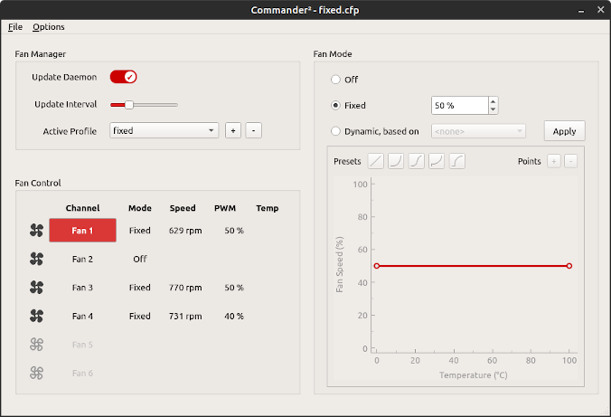
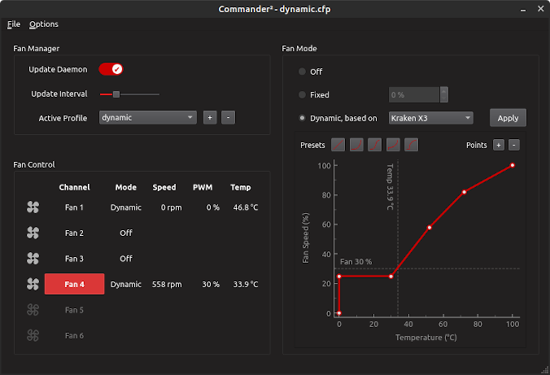
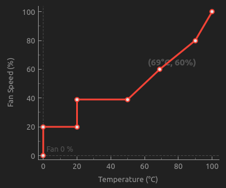

# Commander Fan Control (cfancontrol)

A manager for the Corsair Commander Pro fan controller for Linux written in Python with a GUI based on the QT framework. Manage the speeds of all connected fans individually and based on different temperature probes.

A driver for the Corsair Commander Pro was added to the kernel in version 5.9, so this will be the minimal Linux version required.

## Aknowledgements

Initially inspired by [afancontrol](https://github.com/KostyaEsmukov/afancontrol) and using the wonderful [liquidctl](https://github.com/liquidctl/liquidctl) for the fan control and as wells as to access temperature sensors in all-in-on liquid coolers (AIOs). Other temperature sensors in the system are detected via the [lm-sensors](https://hwmon.wiki.kernel.org/lm_sensors) package (and the [PySensors](https://pypi.org/project/PySensors/) module). The widget to manage the fan curves is based on the one in [qt-amdgpu-fan-ctl](https://github.com/wepiha/qt-amdgpu-fan-ctl).

## Screenshots

##### Light Theme



##### Dark Theme



## Requirements

### lm-sensors

The lm-sensors package should be installed on your system. Most Linux distributions are having this installed by default or provide a package in their repositories. You can test the proper function of this package by issuing the command:

```bash
$ sensors
```

### Python libraries

cfancontrol itself requires the following additional Python libraries in their respective (minimal) versions:

- PyQt5~=5.12.3
- pyqtgraph~=0.12.4
- liquidctl~=1.8.1
- numpy~=1.17.4
- PyYAML~=5.3.1
- PySensors~=0.0.4
- pid~=3.0.4
- pyxdg~=0.28

## Installation

The installation is best done via pip from inside the downloaded repository:

```bash
$ pip install --user .
```

If you like to run cfancontrol system wide or as a daemon, install as root:

```bash
$ sudo pip install .
```

## Configuration

### hwmon Sensors

Temperature sensors exposed through the Linux hardware monitoring kernel API (hwmon:sysfs-interface) are automatically detected via lm-sensors package:

##### Labeling Sensors

The sensors can be labeled (and unused ones ignored) by editing the file `~/.config/cfancontrol/sensors3.conf` (for a regular user) -or-  `/etc/sensors3.conf` (for root user). A guide to the format of these files can be found [here](https://linux.die.net/man/5/sensors3.conf).

**Example**: to change the temperature sensor for an AMD CPU to show up as 'CPU' amend the config file as follows:

```bash
# AMD CPU sensor
chip "k10temp-pci-*"
  label temp1 "CPU"
  ignore temp2
```

### AIOs

The temperature sensors of all-in-one liquid coolers supported by liquidctl can also be used. To check for detected devices use this command:

```bash
$ liquidctl list
Device #0: Corsair Commander Pro (experimental)
Device #1: NZXT Kraken X (X53, X63 or X73)
Device #2: Gigabyte RGB Fusion 2.0 5702 Controller
```

**Note**: Supported devices right now are the 'NZXT Kraken X3' and 'Corsair Hydro' series of AIOs. Other devices supported by liquidctl may easily be added, but I do not have them for proper testing.

## Usage

Use this command to start the program (it will be run as GUI and uses a configuration file for its settings):

```bash
$ cfancontrol gui -s
```

For more options and details run the `cfancontrol -h` command for a usage summary:

```bash
usage: cfancontrol [-h] [-a] [-i INTERVAL] [-p PROFILE_FILE] [-l {0,10,20,30,40}] [-t {light,dark,system}] [-s] {daemon,gui}

positional arguments:
  {daemon,gui}          mode to run cfancontrol (daemon or gui)

optional arguments:
  -h, --help            show this help message and exit
  -a, --autostart       auto start fan manager (requires profile)
  -i INTERVAL, --interval INTERVAL
                        update interval for fan manager
  -p PROFILE_FILE, --profile PROFILE_FILE
                        profile file to load at startup
  -l {0,10,20,30,40}, --loglevel {0,10,20,30,40}
                        log level
  -t {light,dark,system}, --theme {light,dark,system}
                        application theme
  -s                    load settings from file
```

### Modes

##### Daemon

Runs the program as a daemon without the GUI. This can be useful when using cfancontrol in a system service or run system wide at startup for unsupervised systems. **Note:** This mode implies the `-a` option and requires `-p PROFILE_FILE` option or an equivalent in the settings file with `-s` option.

##### GUI (recommended)

Loads cfancontrol with the main GUI to set up and manage fan speeds and profiles. The GUI starts minimized and has its own tray icon.

### Settings File

The program settings are stored in a settings file `config.yaml` located in the configuration directory of the user, typically `$HOME$/.config/cfancontrol`.

### Profiles

Fan speed configurations are saved in profiles files named `'profile'.cfp`. A profile saves all the information about fan mode and fan speed curves for each connected fan. Profiles can be changed easily and quickly e.g. to support low and high system usage scenarios.

### Fan Modes

Each connected fan can be run in a specific fan mode: `off`, `fixed` or `dynamic`.

##### Fixed

Runs the fan at a fixed speed in percent of maximum PWM level. **Note:** every PWN fan has a different level at which it starts running (usually around 20%-30% level). Use different fixed speeds to identify this minimal level.

##### Dynamic

In dynamic mode, the fan speed is periodically adjusted depending on the temperature of the assigned temperature senor as defined in the fan curve.

### Fan Curves

The fan curve defines the relationship between the sensor temperature and fan speed. A fan curve can have up to 10 segments and allows for very specific management of fan speeds.

##### Presets

A set of fan curves for general use cases. Linear, exponential and logistic curves are available as well as a semi-exponential curve with a minimal level and semi-logistic with a temperature threshold.

##### Manual

Manual fan curves can be created by adding/removing segments and by adjusting the segments of the curve. The segment end-points can be moved around by a click-and-drag operation:


